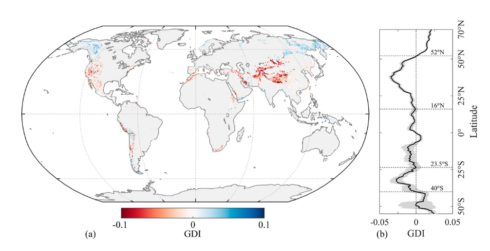
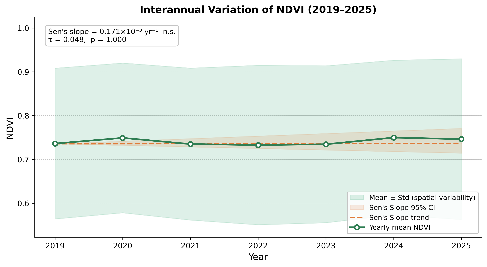
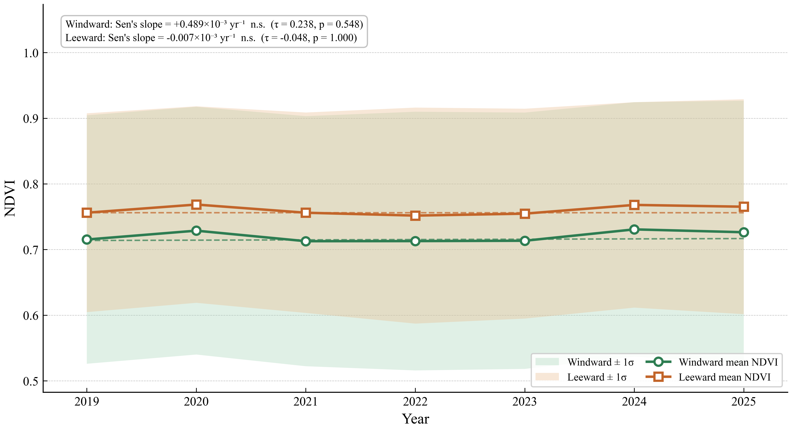
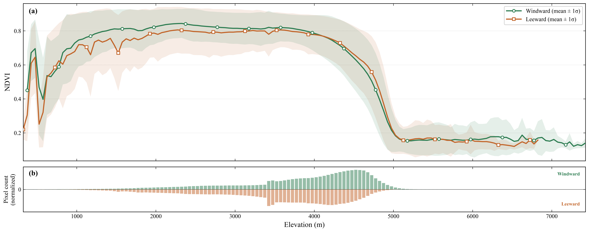

# 2026/03/05 任务说明

核心: 基于风向划分迎风坡、背风坡, 提取不同海拔梯度的植被差异

简要: 研究主要集中在川西地区, 分析在迎风坡和背风坡区域里不同海拔梯度下的
        植被差异, 植被差异通过NDVI值的差异来表示, NDVI基于Sentinel-2的高
        分辨率数据进行计算.

## 说明

研究区域: 川西地区
植被指标: NDVI(由于需要高分辨率, 因此使用Sentinel-2)
工具: GEE实现

## 注意事项和疑惑

1. 时间范围是多少？研究区域具体是哪里?
2. 迎风坡和背风坡根据什么来划分?是否因时间而变化?
3. 海拔梯度暂定为100m间隔;
4. NDVI计算依据Sentinel-2计算, 但是是否还需要进行额外处理?例如SG滤波等;
5. 最终植被差异以什么形式来呈现, 哪种图哪种表格呢?

# 2026/03/07 情况说明

1. 关于迎风坡和背风坡, 考虑使用saga-gis的Wind Effect根据来划分;
   或者这样考虑更好: 直接分8个坡向和平地, 而只在论文阐述上说明迎风坡和背风坡;
2. 川西地区的边界需要获取得到, 目前是取甘孜、阿坝、凉山三个州作为研究区域进行研究;
3. 还有DEM数据集, 之前有全球1km的数据集, 但是现在需要下载10m分辨率的数据集配合Sentinel-2;
4. 时间尺度是多少呢?是一个月?一个季节?还是分雨季和旱季呢?或者干脆一年?

# 2026/03/09 情况说明

1. 关于时间尺度, 目前按照年尺度先进行研究;
2. 对于已经下载的ALOS DEM数据集(大概率弃用), 虽然其标注了12.5m分辨率的数据集, 但是实际上对于中国及其其他大部分区域, 都是
基于SRTM数据集的30m分辨率上采样得来的, 具体见官方文档(https://asf.alaska.edu/wp-content/uploads/2019/03/rtc_product_guide_v1.2.pdf):
Assets/Ref/rtc_product_guide_v1.2.pdf; 因此实际上后续研究, 目前(2026/03/09)我们考虑的DEM数据集是使用GLO-30产品, 
从OpenTopography下载(搜索GLO-30即可): https://portal.opentopography.org/dataCatalog
3. 基于GLO-30 DEM产品进行裁剪、掩膜和重采样(10m)以及表面参数计算, 得到DEM、坡度、坡向

# 2026/03/10 情况说明

1. 目前处理年尺度的NDVI, GEE处一年数据需要约2h左右.
2. 关于sentinel-2的去云使用s2cloudless产品, 具体见: https://github.com/sentinel-hub/sentinel2-cloud-detector?tab=readme-ov-file
3. 关于迎风坡和背风坡, 还是着手考虑如何划分!
   目前打算使用saga-gis的Wind Effect工具进行, 见: https://saga-gis.sourceforge.io/saga_tool_doc/2.1.3/ta_morphometry_15.html
   另外需要注意这个wind effect是不是就是风坡夹角或者风效因子, 风坡夹角参考: https://www.cnblogs.com/ChaoQiezi/p/18980920
   关于wind effect, 需要输入风向和风速(例如era5),以及坡向数据; 

# 2026/03/11 情况说明

1. GAI(greenness asymmetric index, 绿度不对称指数), 公式为: GAI = NDVI_PFS / NDVI_EFS
2. GDI(greenness difference index, 绿度差异指数), 公式为: GDI = (NDVI_EFS − NDVI_PFS)/(NDVI_EFS + NDVI_PFS).
3. 目前可能还需要考虑一下是否针对川西地区所有地类进行? 还是只针对和植被相关的地类进行研究呢?

# 2026/3/12 情况说明

1. 迎风坡和背风坡的划分
   
    目前搜集了相关文献, 已经确定使用SAGA GIS的Wind Effect(Windward, Leeward)风效应指数工具进行迎风坡和背风坡的划分
    - 使用数据包括: DEM、ERA5的600hPa(pressure level)的u, v风场数据;
    - 时间维度上的处理, 取多年生长季(6-8月)的u、v均值(基于风速加权), 计算风向数据, 进而计算风效应指数;
    - 空间尺度上的处理, 统一在10m分辨率、投影坐标系上计算风效应指数;
    - 迎风坡和背风坡划分, 根据SAGA GIS说明>1表示处在迎风区, <1表示背风区;
    > The 'Wind Effect' is a dimensionless index. Values below 1 indicate wind shadowed areas whereas values above 1 
    > indicate areas exposed to wind

    参考文献:
    > Gerlitz-2015, Bohner-2006, Bohner-2009, Karger-2017;

# 2026/03/17 情况说明

## 关于迎风坡和背风坡、NDVI的说明

> 由于川西地区不同时间段所盛行的风系是不一样的, 因此不应从全年所有时间段的
> 数据中计算出的迎风坡和背风坡, 而应基于川西地区盛行风系及其对应时间段进行考虑;
> 此外, 不同时间范围的NDVI也所表征的植被差异也不同, 例如生长季所代表的
> 植被比旱季所代表的植被要高;
> 目前来看, 既要考虑更好地表征年尺度的NDVI, 又要考虑盛行风系及其对应时间段,
> 所选择的时间段应该既可以较好地表征年尺度的NDVI, 又代表川西地区主要的盛行风系;

# 2026/03/18 情况说明

目前为止的疑问包括:

1. 如何划分迎风坡和背风坡?
2. 为什么使用生长季的NDVI来表征年尺度的植被变化?
3. 如何聚合生长季的风向?
4. 使用600hPa的u, v风场数据是否合适?

1. 使用SAGA-GIS的wind effect工具计算风效应指数, 据此进行二分类(划分标准简陋)
2. 首先是全年盛行风系不一致, 在夏季盛行的风系与冬季不一致, 导致计算出来的迎/背
   风坡也不准确;其次, 使用生长季的NDVI可以排除一些其他的干扰, 更好说明该年尺度
   的植被变化;
3. 聚合方法考虑的是风速加权, 即根据风速对风向进行加权平均, 得到该生长季的风向;

2026/3/18 情况说明

1. 目前从gee上下载的NDVI, 存在2017-2018年的数据仅有少部分切片为有效值, 其余切片均为无效值;

# 2026/3/19 情况说明

1. 关于2017-2018年的Setinel-2 Level-2A SR数据大量缺失的问题, 实际上是由于
   欧空局在2018年3月26开始系统性为欧洲提供Level-2A SR数据集, 而对于全球来说
   目前来看至少在川西地区是2019年实现完全覆盖.
   具体为:

>The Sentinel-2 L2 data are downloaded from CDSE. They were computed by running sen2cor. WARNING: 2017-2018 L2 coverage in the EE collection is not yet global.
>New core product (Level-2A surface reflectance)

>generated and distributed since 26 March 2018 for
>Europe.
>Sentinel-2 Mission Status
>Example of Level-2A surface reflectance versus Level-1C (top-of-atmosphere)
>Copyright: Contains modified Copernicus Sentinel data (2018)

参考见:
   - Assets/Ref/1-sentinel-2_mission_status_and_dias_overview_v1_gascon_20181009.pdf)
   - https://developers.google.com/earth-engine/datasets/catalog/COPERNICUS_S2_SR_HARMONIZED?hl=zh-cn#description

解决措施:

   目前来看需要调整时间尺度的范围, 调整为2019年-2025年
   
2. 此外，基于目前的的迎/背风坡的划分, 发现迎风坡所处区域的NDVI大都较小,
   而背风坡所处区域的NDVI大都较大.
   
   - 可能是由于海拔跨度比较大, 高山(>5000m)虽然作为迎风坡但是海拔过高气温较低因此NDVI较低;
   - 可能是由于使用的风场数据是600hPa, 或许应该是使用u10和v10, 或者应该进一步进行文献调研了解wind effect工具传入的风场数据;

# 2026/3/23 情况说明(组会总结)

1. 完成情况:
   
   - 完成迎风坡和背风坡的划分(基于Wind Effect风效应指数)
   - 完成NDVI的下载(2017年-2025年)

2. 老师建议(仅参考)

   - 考虑引入雨季前后的对比;
   - 进行垂直梯度的对比分析时, 200m的海拔梯度跨度过大, 应设置更小例如50m;
   - 对于NDVI分析, 分析部分年份也可, 例如2019年-2025年, 前面的2017-2018年考虑丢弃;

# 2026/3/25 情况说明

1. 目前已经将从GEE-Drive下载的NDVI数据集进行预处理(但是小于0.1的NDVI设置为nan没有处理);
2. 今天要完成的是空间尺度上的分析: 

   - 年均值空间分布图(年聚合使用max);
   - 年际均值空间分布图(年际聚合使用mean);
   - 空间分布图轴边记录纬度上的NDVI变化;

# 2026/3/28 情况说明

1. 目前已经完成了NDVI年尺度的时间序列变化的绘制;

> --- Mann-Kendall Trend Test Results ---\
> Trend direction : no trend\
> p-value         : 1.0000\
> Kendall tau (τ) : 0.0476\
> Sen's Slope     : 0.000171  (95% CI: -0.003542 ~ 0.005848)\
> Sen's Intercept : 0.7357\
> Significant     : No ✗  (α = 0.05)\
> Figure saved to: G:\GeoProjects\dry_hot_valley\Result\Chart\NDVI_time_series.png\

2. 目前已经完成了NDVI年尺度的空间分布图的绘制;

3. 关于1的NDVI时间序列变化, 没有区分迎风坡和背风坡, 此处仍是进行NDVI时间序列变化分析
   但是区分迎风坡和背风坡.

# 2026/3/29 情况说明

1. 目前正在处理不同海拔梯度下迎风坡和背风坡的NDVI统计值, 并绘制出图;

# 2026/3/31 情况说明

1. 目前已经完成不同海拔梯度下迎风坡和背风坡的NDVI.

2. 关于趋势分析, 前面的NDVI年尺度时间序列变化已经尝试绘制和表达,但是
   发现2019-2025年期间的NDVI并不存在显著的趋势, 因此后续不往趋势方向进行分析;

3. 目前迎风坡和背风坡不同年份下和不同海拔下的NDVI变化呈现看起来相反的状况:

> 在不同年份下, 背风坡的NDVI均值都是大于迎风坡的NDVI均值(尽管反常识)\
> 在<4100m的海拔区域, 迎风坡的NDVI均值大于背风坡的NDVI均值\
> 在>4100m但小于5000m的海拔区域, 迎风坡的NDVI均值小于背风坡的NDVI均值
> 在>5000m的海拔区域, 迎风坡和背风坡的NDVI均值均小于0.3;

4. 基于NDVI年际均值栅格, 分别计算迎风坡和背风坡的NDVI均值, 结果与3中不同年份下的结果一致;

通过上面的分析和绘制的图, 可以发现, 应该是4000m-5000m范围背风坡的NDVI大于迎风坡的NDVI, 且其占主导地位, 因此
导致在不同年份下, 背风坡的NDVI均值大于迎风坡的NDVI均值.

`ps`: 我觉得出现背风坡大于迎风坡的NDVI均值, 可能是由于没有做好过滤: 例如高海拔裸地/冰雪像元被纳入了迎风坡统计

5. 进行土地利用类型(MCD12Q1)的预处理

# 2026/4/1 情况说明

1. 目前正在下载ERA5的2m气温数据集(temperature_2m)、总降水量数据集(total_precipitation)  --> 已完成

> 今后规定, 川西地区的地理范围边界: 36°N, 96°E, 24°N, 106°E = 北, 西, 南, 东

2. 目前正在处理GAI的统计值, 并绘制出图;  --> 已完成[show_time.py](..%2FShowTime%2Fshow_time.py)

3. 目前正在处理土地利用类型数据(MCD12Q1)  --> 已完成

# 2026/4/2 情况说明

1. 目前正在为预处理添加一步过滤, 即基于MCD12Q1数据集进行非植被像元的掩膜过滤;
   
 - 针对`ndvi_preprocess.py`中的`remove_invalid_values`函数进行修改

2. 目前完成了DEM重分类(gradient=1000m)和空间分布可视化;

# 2026/4/8 组会总结

1. 当前的研究没有紧扣干热河谷这一主题进行研究, 过于发散
2. 下一步研究方向
   
   - 地理单元划分: 建议先提取具体的河谷（如大渡河、雅砻江等）及流域范围，将研究区域限定在河谷两侧
的山体上。
   - 对比逻辑重构：在河谷内部，将左侧山体的像元与其对应的右侧山体像元进行比对，结合风向因素，分析
河谷两侧植被的差异性。

# 2026/4/9 情况说明

1. 查阅 CNKI 上关于干旱河谷划分的文献，重点关注成都生物所 `包维楷老师` 的相关文章与划分标准。
2. 调整研究方向，聚焦于干旱河谷区域，并引入河谷左右岸对比的分析方法。 

> 关键难点在于三方面:
> 1. 如何获取得到川西地区的干热河谷区域?
> - 是否可以直接网络检索得到各个河谷的边界shp文件
> - 是否可以找到河谷划分的标准方法?
> 2. 针对某一个河谷地区, 如何进行左右岸对比分析?
> 3. 如何将河谷左右岸与迎风坡和背风坡耦合分析?

solve: 已经解决获取得到了中国西南地区干热河谷区域边界shp文件
> https://www.msdc.ac.cn/#/datadetails?id=57

# 2026/4/10 情况说明

1. 今天主要需要完成的是两部分:
   
   - 完成河谷中心线的提取;
   - 初步的两岸对比代码框架;

2. 方向矫正: 之前是直接河谷两岸的对应像元进行对比,但是实际上赵关于河谷方面的
   对比是对于河谷左岸的像元, 应该与该像元所在山脉另外一侧对应的像元进行对比.
   对于河谷右岸的像元, 也应该与该像元所在山脉另外一侧对应的像元进行对比.

# 2026/3/13 情况说明

目前基于河谷这个框架内算是有一个初步的想法了

1. 首先划分河谷内侧和河谷外侧
   
   具体通过河谷两侧的山脊线提取河谷内侧和河谷外侧的边界;

2. 基于河谷内外侧在3km×3km格网进行GAI分析
3. 基于海拔梯度和河谷内外侧进行NDVI随海拔变化分析: 河谷侧迎风坡、河谷侧背风坡、外侧迎风坡、外侧背风坡"四类像元分别随海拔的NDVI曲线

目前将获取的干热河谷边界数据作为河谷内侧, 对其进行2km缓冲(不含边界内部)得到河谷外侧.
栅格值具体为:
   十位数: 1: 大渡河干旱河谷, 2: 岷江干旱河谷, 3: 金沙江干旱河谷, 4: 雅磨江干旱河谷
   个位数: 1: outer, 2: inner

# 2026/4/14 情况说明

## 关于
1. 目前已经完成(细化到干热河谷范围)
   
   - GAI空间分布的分析
   - NDVI海拔梯度变化的分析
   - NDVI年际变化的分析

## 后续应该都聚焦于干热河谷范围, 而不是整个川西地区, 否则就没有扣住研究主题

# 2026/4/15 情况说明

